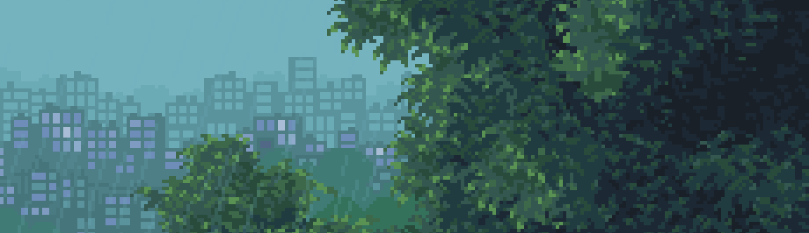
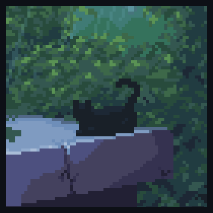

  

---

  <strong>About Me</strong>

 

I'm an aspiring full-stack developer with a strong interest in game development. I currently build games using MonoGame, although I started with Godot, which helped me understand the fundamentals before moving into a more code-focused approach.

Alongside that, I build web and mobile applications using HTML, CSS, JavaScript, TypeScript, Tailwind CSS, Flutter, and React-based tools. I mainly use Supabase for backend and database, but I've also worked with Firebase, PostgreSQL, and Vercel depending on the project.

I've been using Visual Studio Code since 2018, so it's where I'm most comfortable working. I also use GitHub regularly to manage projects, track changes, and improve my workflow over time.

Right now, I focus on building real projects, whether it's web apps, mobile apps, or small games. Not just for learning, but to actually create things that work and improve through experience.

I'm still learning, and I don't consider myself an expert yet. But I stay consistent, keep building, and continue improving my skills over time.

 

---

## Let's Connect

  
  
  
  

---

## Tech Stack

<table>
  <tr>
    <td width="33%" valign="top">
      <strong>Frontend</strong>
        
      
      
       
      
      
       
      
      
       
      
      
    </td>
    <td width="33%" valign="top">
      <strong>Backend</strong>
        
      
      
       
      
      
       
      
      
    </td>
    <td width="33%" valign="top">
      <strong>Workflow</strong>
        
      
      
       
      
      
    </td>
  </tr>
</table>

---

## Note

<table>
  <tr>
    <td width="78%" valign="top">
      What you see here is the result of ongoing work.
        
      I build, test, and refine projects over time. Some ideas work, some don't, but each one helps me improve and move forward.
    </td>
    <td width="22%" align="right" valign="top">
      
    </td>
  </tr>
</table>

---

## Currently Building

<table>
  <tr>
    <td width="50%" valign="top">
      <strong>Web & Mobile Projects</strong>
        
      Building practical apps with <strong>TypeScript</strong>, <strong>Flutter</strong>, and backend tools like <strong>Supabase</strong> and <strong>Firebase</strong>.
    </td>
    <td width="50%" valign="top">
      <strong>Game Development</strong>
        
      Exploring game systems and architecture through hands-on work with <strong>MonoGame</strong> while improving through real, consistent projects.
    </td>
  </tr>
</table>

  
  
  
  

---

## Statistics

  
  

  

  

---

  

